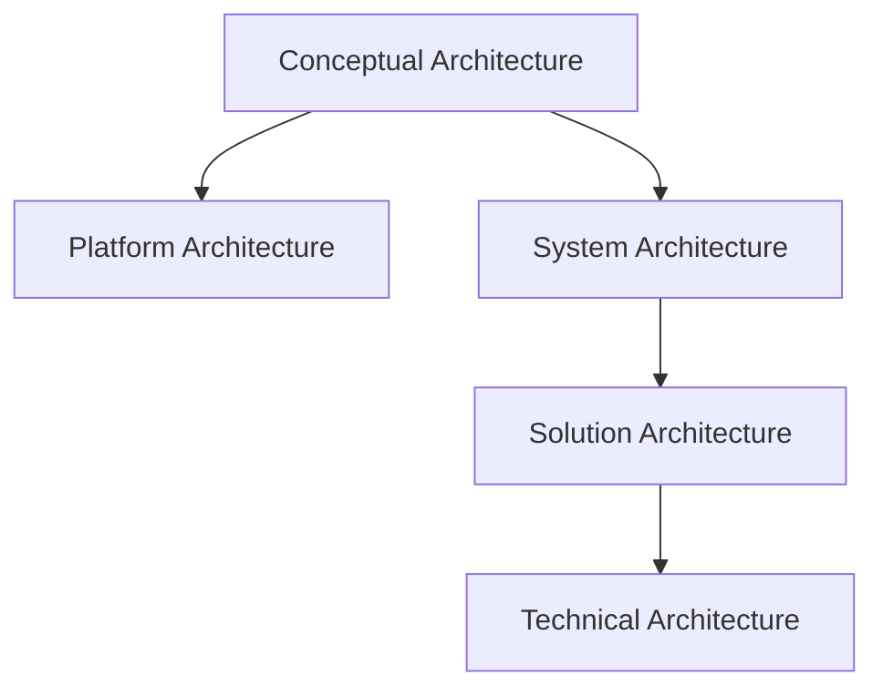

# Architecture Types Comparison – Including Conceptual Architecture

This comparison includes all five architecture layers: **Conceptual**, **Platform**, **System**, **Solution**, and **Technical**.

---

## Summary Table

| **Type**                 | **Purpose**                                    | **Scope**                 | **Detail Level** | **Examples**                                   |
|--------------------------|------------------------------------------------|---------------------------|------------------|------------------------------------------------|
| Conceptual Architecture  | Understand business concepts and interactions | Business domains          | Very High        | Users, Chat Interface, LLM Assistant           |
| Platform Architecture    | Reusable foundation for multiple solutions     | Org-wide or product-line  | High             | Auth, Billing, GPT SDK                         |
| System Architecture      | Structure of a full system                     | Product suite or domain   | High             | Mobile app, backend, database, APIs            |
| Solution Architecture    | Solve a specific problem with the system       | Specific application      | Medium           | GPT Chat Assistant for Maintenance             |
| Technical Architecture   | Tech stack, deployment, tools, configuration  | Implementation layer      | Low              | FastAPI, AWS Lambda, Cognito, gspread          |

---

## Visual Hierarchy

---

## Layer-wise Explanation

### 1. **Conceptual Architecture**
- Represents business concepts, actors, and their relationships
- Technology-agnostic
- Helps stakeholders understand "what the system does" before deciding "how"

### 2. **Platform Architecture**
- Shared infrastructure and services used by multiple apps or domains
- Includes auth, observability, billing, tenant services

### 3. **System Architecture**
- Complete map of components and subsystems
- Shows how the whole product ecosystem functions

### 4. **Solution Architecture**
- Focused on implementing one solution or feature using components of the system/platform
- Often paired with HLD (High-Level Design)

### 5. **Technical Architecture**
- Actual technology choices and integration
- Code structure, APIs, cloud services, deployment pipelines

---

## Architecture vs Design Recap

| **Aspect**         | **Architecture**                                                | **Design**                                                       |
|--------------------|------------------------------------------------------------------|------------------------------------------------------------------|
| **Definition**     | Structure of components and how they interact                   | Internal logic and implementation within components              |
| **Abstraction**    | High-level (macro view)                                          | Low-level (detailed logic)                                       |
| **Focus**          | What are the parts? How do they connect?                        | How is each part built internally?                              |
| **Who uses it**    | Architects, Tech Leads                                           | Developers, Designers                                            |
| **Output**         | Diagrams, component models, deployment structure                | Class diagrams, DB schema, code structure                        |
| **Examples**       | System layout, platform map, GPT assistant architecture          | API contracts, error handling, database design                   |
