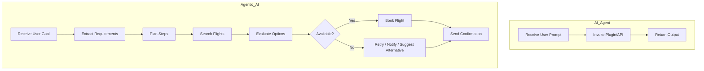

# AI Agents vs Agentic AI: Detailed Analysis

## 1. Introduction

In the evolving landscape of Artificial Intelligence, the concepts of **AI Agents** and **Agentic AI** are gaining prominence. Though they sound similar, they differ fundamentally in their scope, complexity, and behavior.

---

## 2. What is an AI Agent?

An **AI Agent** is a system that perceives its environment, processes input, and performs an action to achieve a specific goal. These are task-specific, goal-driven programs, often operating in a reactive or single-turn context.

### **Characteristics:**
- Reactive and goal-oriented
- Often stateless or limited context
- May integrate tool usage or APIs
- Generally focuses on *narrow* tasks

### **Examples:**
- Chatbots
- Personal Assistants (e.g., Siri, Alexa)
- Rule-based automation bots (e.g., RPA)
- LLM-based single-step tools (e.g., ChatGPT using a plugin)

---

## 3. What is Agentic AI?

**Agentic AI** refers to an architectural paradigm where AI systems are *agent-like*, but enhanced with *planning, memory, reflection, tool use, and autonomy*. It allows AI to take initiative, plan multi-step tasks, and evolve over time.

### **Characteristics:**
- Embodies true agency: Initiates and executes tasks
- Maintains memory across sessions
- Involves long-term planning and decision making
- Uses tools and APIs autonomously
- Often built using multi-agent systems

### **Examples:**
- AutoGPT, BabyAGI, Devin
- CrewAI multi-agent orchestration
- AI project managers or R&D copilots

---

## 4. Key Differences

| Feature                     | AI Agents                                                             | Agentic AI                                                                                       |
|----------------------------|-----------------------------------------------------------------------|--------------------------------------------------------------------------------------------------|
| **Scope**                  | Narrow, task-specific                                                 | Broad, multi-step and autonomous                                                                |
| **Autonomy**               | Medium (acts on commands/prompts)                                    | High (initiates and manages goals)                                                              |
| **Planning**               | Minimal or absent                                                    | Goal decomposition and task planning                                                            |
| **Memory**                 | Stateless or short context                                            | Long-term memory and reflection                                                                |
| **Tool Usage**             | May use tools when prompted                                           | Selects and invokes tools contextually                                                         |
| **Coordination**           | Single agent                                                          | Often uses multi-agent collaboration                                                           |
| **Adaptability**           | Limited                                                               | Adapts dynamically, self-corrects                                                              |
| **Real-world Application** | Chatbots, plugins, automation bots                                   | Self-directed agents like AutoGPT, AI product developers                                        |

---

## 5. Real-World Example: Booking a Flight

### **Scenario**: User says: “Book me a flight to Mumbai”

| Aspect               | **AI Agent Behavior**                                                                 | **Agentic AI Behavior**                                                                                          |
|----------------------|----------------------------------------------------------------------------------------|------------------------------------------------------------------------------------------------------------------|
| **Input**            | User prompt: "Book me a flight to Mumbai"                                             | User goal: "Book me a flight to Mumbai"                                                                         |
| **Response**         | Agent responds with best matching results using plugins (e.g., Expedia plugin)        | System plans: search → evaluate → notify → confirm → book                                                       |
| **Planning**         | No planning – plugin call based on prompt                                             | Plans multiple steps: extract location/date, check preferences, query multiple sources                          |
| **Tool Use**         | Calls Expedia or Skyscanner plugin directly                                           | Chooses between APIs (Expedia, Google Flights), fetches best price, may retry failed bookings                  |
| **Adaptation**       | Cannot retry or modify request unless re-prompted                                    | If flights unavailable, shifts to nearby airports, alerts user, reschedules                                     |
| **Outcome**          | Returns top few flights and waits for user input                                      | Books best match and sends email confirmation with invoice                                                       |
| **Experience**       | One-shot interaction                                                                  | Autonomous goal completion with minimal user effort                                                              |

---

## 6. Mermaid Diagram: Lifecycle Comparison

---

## 7. Summary Table

| Dimension              | AI Agents                       | Agentic AI                                      |
|------------------------|----------------------------------|-------------------------------------------------|
| **Design Pattern**     | Narrow-task logic                | Autonomous orchestration                        |
| **Goal Management**    | Task-level                       | Goal-level with subtask planning                |
| **Memory**             | Short-term or none               | Long-term memory (episodic)                     |
| **Learning Loop**      | Static or passive learning       | Reflection, feedback loop, self-improvement     |
| **User Involvement**   | High (for every step)            | Low (only goal-setting)                         |
| **Tools**              | Uses when instructed             | Selects tools based on plan                     |
| **Example Use Case**   | Booking response using Expedia   | Full autonomous travel assistant                |

---

## 8. Final Thoughts

- **AI Agents** are ideal for reactive, simple, or API-connected tasks.
- **Agentic AI** is the next evolution, especially for enterprises needing autonomous orchestration, research workflows, or multi-task coordination.
- The line between the two is blurring with advancements in LLMs, memory, and tool integration.

---

## 9. References

- OpenAI Function Calling / GPT-4 Agents  
- AutoGPT / BabyAGI GitHub Projects  
- CrewAI Multi-Agent Framework  
- Devin (AI software engineer) by Cognition Labs
