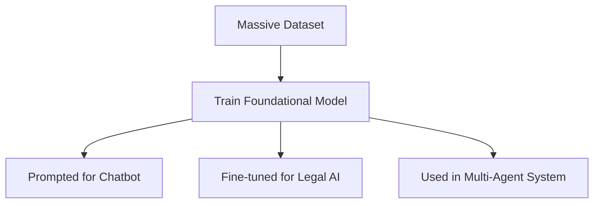
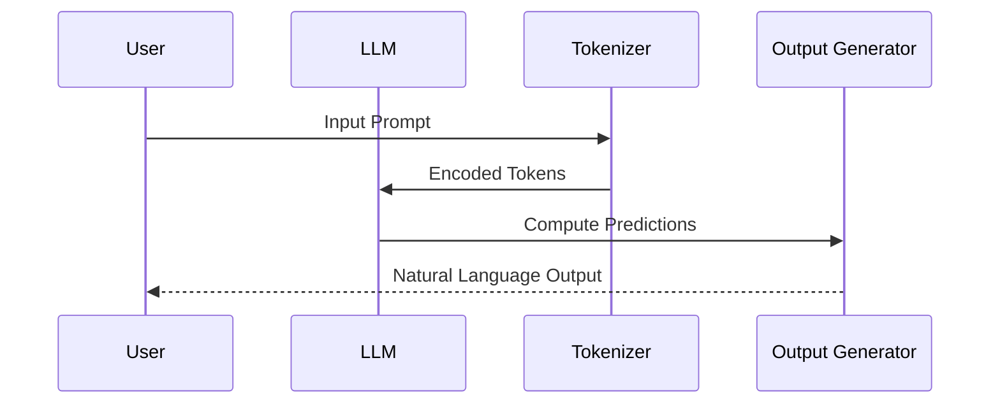

# Demystifying Large Language Models (LLMs)

Large Language Models (LLMs) have revolutionized how machines understand and generate human language. In this article, we explore what LLMs are, how they work, who provides them, and how they're evolving into multi-modal systems.

---

## What is an LLM?

A **Large Language Model** is a type of artificial intelligence trained on massive volumes of text data using deep learning techniques. They use architectures like **transformers** to predict and generate language outputs based on input prompts.

### Key Characteristics
| Feature           | Description |
|-------------------|-------------|
| **Model Type**    | Usually Transformer-based |
| **Training Data** | Billions to trillions of tokens |
| **Task**          | Language understanding and generation |
| **Examples**      | Text summarization, translation, Q&A, coding |

---

## What are Foundational Models?

**Foundational models** are large-scale models trained on broad data (like text, code, audio, or images) that can be adapted (fine-tuned or prompted) for a wide variety of downstream tasks.

They are called *foundational* because they serve as the **base for many other specialized models** or applications.

### Characteristics

| Aspect                  | Description |
|--------------------------|-------------|
| **Trained on**          | Massive, diverse datasets |
| **Architecture**        | Typically Transformer-based |
| **Usage**               | Can be fine-tuned or prompted |
| **Adaptability**        | High (text summarization, Q&A, translation, etc.) |
| **Examples**            | GPT-4, Claude, Gemini, LLaMA, PaLM, Chinchilla |

### Why are they important?

- Enable **transfer learning** at scale
- Provide **zero-shot**, **few-shot**, and **fine-tuned** capabilities
- Serve as the base layer for multi-modal systems and agentic workflows



---

## LLM Providers

| Provider       | Model Name(s)               | Notable Features                    | Public Access |
|----------------|-----------------------------|-------------------------------------|---------------|
| OpenAI         | GPT-3.5, GPT-4, GPT-4o       | Strong general-purpose performance | Yes (API)     |
| Google         | Gemini 1.5                  | Multimodal, long context            | Yes (API)     |
| Anthropic      | Claude 3                    | Safety-aligned, chat-centric        | Yes (API)     |
| Mistral        | Mistral 7B, Mixtral         | Open-weight, performant             | Yes (Open)    |
| Meta           | LLaMA 2, LLaMA 3            | Open-source, research-friendly      | Yes (Open)    |
| Cohere         | Command R+, Embed           | Retrieval-augmented, embeddings     | Yes (API)     |
| Amazon         | Titan                       | Part of Bedrock                     | Yes (API)     |
| Alibaba, Baidu | Qwen, ERNIE                 | Chinese-language optimized          | Yes (API)     |

---

## Tokens, Context Window, and Parameters

### What is a Token?

A **token** is a piece of text—like a word or subword—used as input/output by LLMs.

| Phrase | Tokens Example (English) |
|--------|---------------------------|
| "Hello world" | ["Hello", " world"] (2 tokens) |

### What is Context Window?

The **context window** defines how much information (in tokens) the model can consider at once.

| Model     | Max Context Window (tokens) |
|-----------|-----------------------------|
| GPT-4     | 8K / 32K                     |
| GPT-4o    | 128K                         |
| Claude 3 | 200K                         |
| Gemini 1.5 | 1M (in testing)            |

---

## Parameters

**Model parameters** refer to the number of weights in the neural network. Larger models tend to be more powerful but also more resource-intensive.

| Model     | Parameters (approx.) |
|-----------|----------------------|
| GPT-3     | 175B                 |
| LLaMA 2   | 7B, 13B, 65B         |
| Claude 2 | ~52B (est.)          |
| Mixtral   | Mixture of Experts (12.9B active per run) |

---

## Flow of LLM Inference



---

## Text-only vs Audio vs Multi-modal Models

| Model         | Input Modalities       | Output Modalities      | Notes                         |
|---------------|------------------------|-------------------------|-------------------------------|
| GPT-3.5, GPT-4| Text                   | Text                    | Text-only                     |
| GPT-4o        | Text, Image, Audio     | Text, Image, Audio      | Fully multi-modal             |
| Gemini        | Text, Image, Audio     | Text, Image             | Multi-modal                   |
| Whisper       | Audio                  | Text                    | Speech recognition model      |
| DALL·E        | Text                   | Image                   | Text-to-image generator       |

---

## Connection Between LLMs and Multi-modal AI

Traditional LLMs focus on understanding and generating text. However, **multi-modal models** combine multiple data types—text, images, audio, and video—to produce more comprehensive and intelligent behavior.

```mermaid
flowchart TD
    A[Input: Text/Image/Audio] --> B[Tokenizer + Encoder per Modality]
    B --> C[Unified Latent Space Representation]
    C --> D[Transformer Block (Multi-modal Model)]
    D --> E[Generate Response: Text/Image/Audio]
```

---

## Summary

- **LLMs** are foundational to modern AI, enabling applications from chatbots to code generation.
- **Foundational models** are the base upon which specialized models and AI systems are built.
- Providers like OpenAI, Google, and Meta are advancing LLM and multi-modal capabilities.
- Understanding **tokens**, **context window**, and **parameters** is key to using LLMs effectively.
- The future is **multi-modal**, where models can seamlessly interact with text, images, and audio.

---

*Ready to explore how LLMs can power your next product? Let’s dive deeper in the next article!*


---

## Practical Usage: LLMs in Document Understanding Workflows

Large Language Models are not just about chatbots—they're increasingly used in document understanding pipelines. Many organizations process unstructured documents like PDFs, scanned forms, or handwritten notes.

Here’s a high-level flow showing how these documents are prepared and fed into LLMs:

```mermaid
flowchart TD
    A[Scanned Document or Image PDF] --> B[OCR Processing (Textract/Whisper)]
    B --> C[Extracted Text with Metadata]
    C --> D[Chunking + Cleaning]
    D --> E[Embedding (Optional) or Direct Prompt Construction]
    E --> F[LLM Interaction (Prompt / RAG)]
    F --> G[Answer / Summary / Classification / Action]
```

### Step-by-Step Breakdown

| Step | Description |
|------|-------------|
| **OCR** | Extracts text and layout from images or scanned PDFs (e.g., Amazon Textract, Google Vision, Whisper for audio). |
| **Chunking** | Splits long documents into smaller, meaningful segments to fit within LLM context windows. |
| **Cleaning** | Removes noise like headers, footers, or watermarks to improve prompt clarity. |
| **Embedding** *(optional)* | Converts text chunks into vector embeddings for similarity search using tools like FAISS or Pinecone. |
| **Prompting** | Selected or raw chunks are included in prompts passed to LLMs for question-answering, summarization, or extraction. |
| **LLM Output** | The LLM generates structured output: answers, summaries, decisions, or field extractions. |

### Real-World Examples

- **Invoice Extraction:** Textract → Cleaned Fields → LLM formats JSON for ERP ingestion
- **Contract Review:** OCR → Chunk → Retrieve key clauses → LLM summarizes risks
- **Clinical Notes:** Handwritten notes → Whisper/OCR → Chunk → LLM generates discharge summary

This showcases how LLMs form the brain of many real-world AI workflows, leveraging upstream and downstream integrations.
