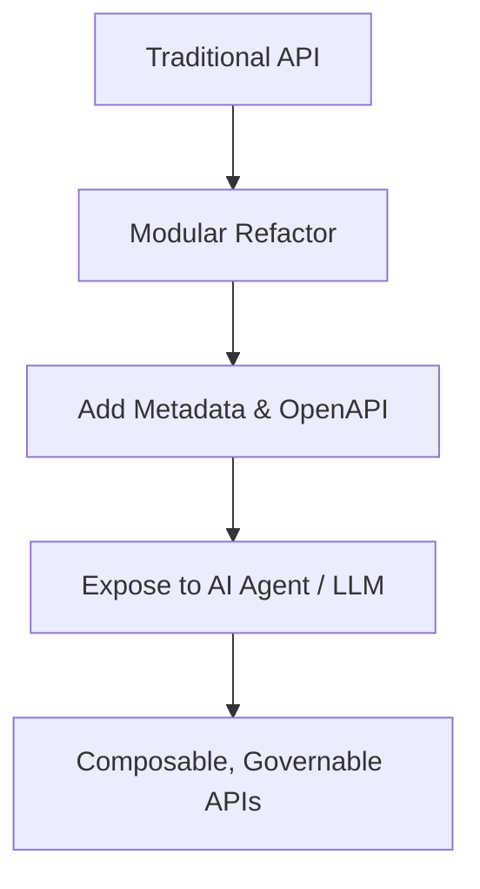

# Modernizing API Platforms: From Traditional Integrations to AI-Ready APIs

---

## 1. Executive Summary

The shift toward AI-first architectures demands APIs that are modular, composable, and governable — enabling them to serve AI agents, LLMs, and orchestration engines effectively. This document compares traditional APIs with AI-ready APIs, outlines their differences, and provides guidance on evolving your API platform to support intelligent systems.

---

## 2. Background and Evolution

Traditional APIs were designed for deterministic tasks — CRUD operations, transactional workflows, and predictable consumer behavior. Today’s AI ecosystems introduce dynamic workloads, intelligent agents, and multi-step reasoning processes, all of which depend on APIs that are discoverable, flexible, and autonomous.

---

## 3. Traditional vs AI-Ready APIs (Comparative Table)

| Dimension        | Traditional APIs                             | AI-Ready APIs                                   |
|------------------|----------------------------------------------|-------------------------------------------------|
| Purpose          | CRUD, transactional flows                    | Reasoning, inference, orchestration             |
| Design Style     | Rigid schemas, REST/GraphQL                  | Modular, self-describing, composable            |
| I/O Format       | Strict JSON fields                           | Flexible, LLM-compatible inputs/outputs         |
| Discovery        | Developer docs                              | Machine-readable (OpenAPI + metadata)           |
| Consumers        | Developers, apps                            | Agents, LLMs, orchestration pipelines           |
| Rate Limiting    | Per IP, user, or API key                    | Tenant + token-aware + cost-based               |
| Observability    | Logs, latency, errors                        | Token cost, reasoning trace, usage classification |
| Security         | OAuth2, API key, JWT                        | Same + PII protection, contextual policy        |

---

## 4. Core Characteristics of AI-Ready APIs

### a. Composable
APIs are building blocks that can be chained in real-time by agents.

### b. Comparable
Standardized design allows interchangeable use and benchmarking (e.g., different summarization APIs).

### c. Contextual
Includes relevant metadata, request trace, or context window (important for reasoning continuity).

### d. Controllable
Governed through token limits, audit trails, access boundaries, and explainability.

---

## 5. Design Guidelines

| Principle            | Recommendation |
|----------------------|----------------|
| **Single Responsibility** | Keep each API atomic and purpose-driven |
| **Descriptive Inputs**    | Include hints, system messages, structured context |
| **Embeddable**            | Return vector-compatible fields if used in retrieval |
| **OpenAPI Specs**         | Required for machine discovery and orchestration |
| **Prompt Friendly**       | Provide examples, templates, or intent metadata |

---

## 6. Security and Governance

- **Rate limit by tenant or plan**, not just by user/IP
- **Audit trail of agent-driven access**
- **PII/PHI handling and masking for LLMs**
- **Token cost tracking and budgeting per client or endpoint**

---

## 7. Observability in AI Context

| Metric | Traditional | AI-Ready |
|--------|-------------|-----------|
| Latency | Yes | Yes |
| Error Rate | Yes | Yes |
| Token Count | No | Yes |
| Embedding Match Rate | No | Yes |
| Chain Traceability | No | Yes |
| Prompt Injection Detection | No | Yes |

---

## 8. Real-World Examples

| API Use Case | Traditional API | AI-Ready API |
|--------------|------------------|---------------|
| Search       | `GET /search?q=contract` | `POST /semantic-search` |
| Support      | `POST /ticket`           | `POST /intent-detect` |
| Document     | `GET /docs/:id`          | `POST /ask-docs` |
| Insights     | `GET /report`            | `POST /summarize-report` |

---

## 9. Transition Plan

### Step-by-Step API Modernization:
1. **Audit existing APIs** – identify those used by AI/agents
2. **Modularize endpoints** – break down monoliths
3. **Add OpenAPI + metadata** – enable agent discovery
4. **Token + plan-based limits** – control cost
5. **Govern + log access** – protect sensitive data

---

## 10. Visual: API Evolution Flow

---

## 11. Conclusion

> AI-ready APIs don't just expose data — they expose **capabilities**.  
> They must be composable, discoverable, secure, and designed to work in the hands of intelligent systems.

